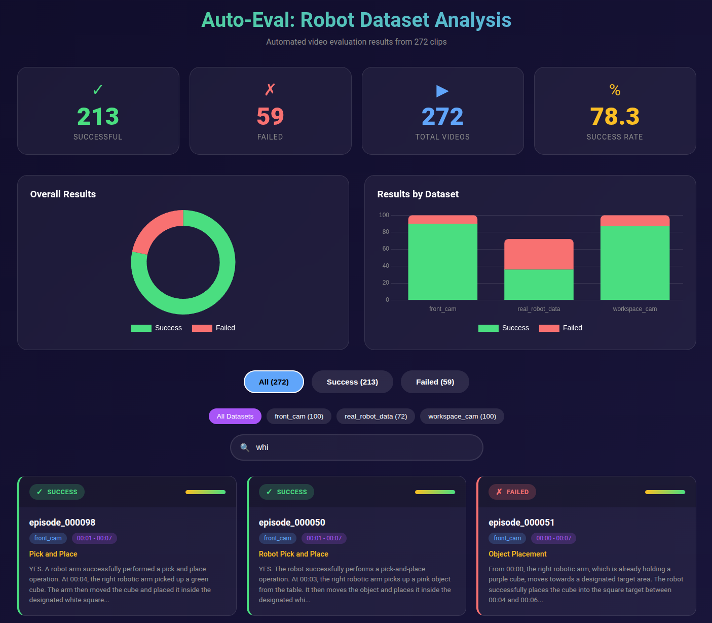

# Auto-Eval: Robot Dataset Evaluation

> Built for the [Voice & Video AI Hackathon](https://luma.com/4cvz0tzf?tk=e5LOpE)

Automated evaluation system for robot manipulation datasets using the NomadicML API. Analyze robot videos from any Hugging Face dataset to evaluate task success, identify failure modes, and generate performance metrics.

**Try the live demo:** [https://autoeval-taupe.vercel.app](https://autoeval-taupe.vercel.app)



## Features

- **Robot Video Analysis**: Evaluate grasp success, object transport, placement accuracy
- **Failure Mode Detection**: Automatically identify why tasks failed (missed grasp, dropped object, collision, etc.)
- **Hugging Face Integration**: Works with any robot dataset from Hugging Face Hub
- **Batch Processing**: Process large datasets efficiently using NomadicML's batch API
- **Custom Queries**: Define your own evaluation queries via CSV files
- **Results Viewer**: HTML-based viewer for browsing analysis results

## Installation

```bash
pip install -r requirements.txt
```

Set your NomadicML API key:
```bash
export NOMADICML_API_KEY="your-api-key"
```

## Usage

### Evaluate Robot Videos

```bash
# Evaluate real robot data (default: 10 videos)
python auto_eval.py --dataset real --limit 10

# Evaluate simulation data
python auto_eval.py --dataset sim --camera front_cam --limit 20

# Use batch mode for faster processing
python auto_eval.py --dataset real --batch --limit 50

# Specify custom video directory
python auto_eval.py /path/to/videos --pattern "*.mp4"
```

### Evaluate from Pre-uploaded Videos

```bash
# Use existing NomadicML folder
python auto_eval.py --use-folder my-robot-videos --limit 100

# Use video IDs from JSON files
python auto_eval.py --from-json datasets/front_cam.json datasets/workspace_cam.json
```

### Download Existing Results

```bash
# List all videos in your account
python download_results.py --list-videos

# Get batch analysis results
python download_results.py --batch-id <batch-id>

# Search across analyzed videos
python download_results.py --search "robot grasping"
```

### View Results

Open `results_viewer.html` in a browser to explore analysis results interactively.

## Supported Datasets

Works with any robot manipulation dataset from Hugging Face Hub containing video files. Examples:
- Pick-and-place task recordings
- Robot arm manipulation videos
- Simulation rollouts (front cam, workspace cam, etc.)

## Default Evaluation Queries

| Query | Description |
|-------|-------------|
| Object Identification | Identifies object type (cube, cylinder, etc.) and color |
| Grasp | Did the robot successfully grasp the object? |
| Transport | Was the object transported without dropping? |
| Place | Was the object placed at the target location? |
| Overall | Was the complete task successful? |
| Failure Mode | If failed, what was the failure mode? |

### Failure Modes Detected

- `MISSED_GRASP` - Gripper missed the object
- `DROPPED_OBJECT` - Object fell during transport
- `WRONG_PLACEMENT` - Placed in wrong location
- `COLLISION` - Hit an obstacle
- `INCOMPLETE` - Task not finished

## Custom Queries

Define your own evaluation queries in CSV files (see `queries.csv` for examples):

```csv
query_label,analysis_query,confidence_level,thumbnail,analysis_type
"My Query","Analyze this robot video for...",high,true,ask
```

## Output

Results are saved to JSON files containing:
- Per-video analysis results
- Success/failure for each evaluation step
- Raw API responses
- Aggregate metrics (success rates, failure mode distribution)

## Project Structure

```
auto_eval/
├── auto_eval.py              # Main evaluation script
├── download_results.py       # Download existing results from NomadicML
├── download_videos.py        # Download videos from Hugging Face datasets
├── run_batch_analysis.py     # Run batch analysis jobs
├── run_simple_analysis.py    # Simple single-video analysis
├── view_results.py           # Generate results viewer
├── results_viewer.html       # HTML results viewer
├── queries.csv               # Evaluation query definitions
└── requirements.txt          # Python dependencies
```

## Requirements

- Python 3.10+
- NomadicML API key
- Dependencies: `nomadicml`, `huggingface_hub`

## License

MIT
